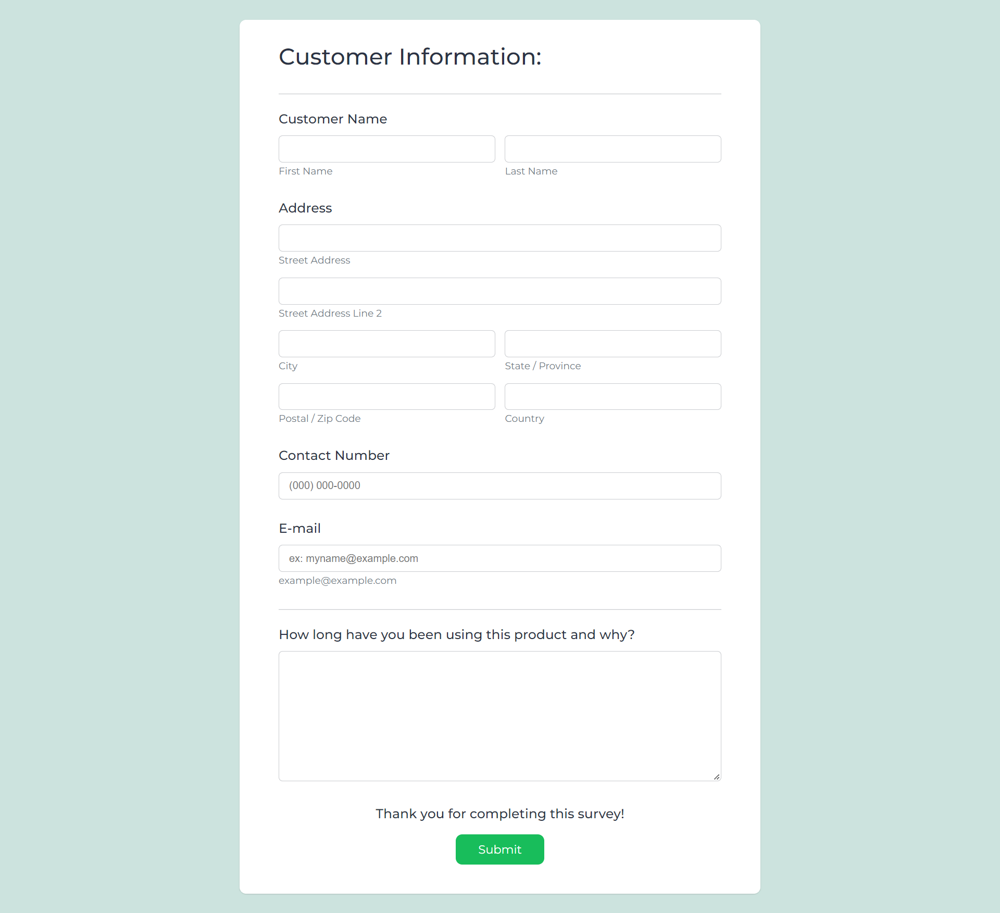

## Product Survey Form

\- Build with **React**

#### To run the program

- #### Clone the repository.

  ```console
  git clone <this-repo>
  ```

- #### install dependencies from 'package.json' file.
  ```console
  cd product-survey-form
  npm install
  ```
- #### Run the app in the development mode.

  `npm run dev`

  Open [http://127.0.0.1:5173/](http://127.0.0.1:5173/) to view it in your browser.

#### Preview Image



---
